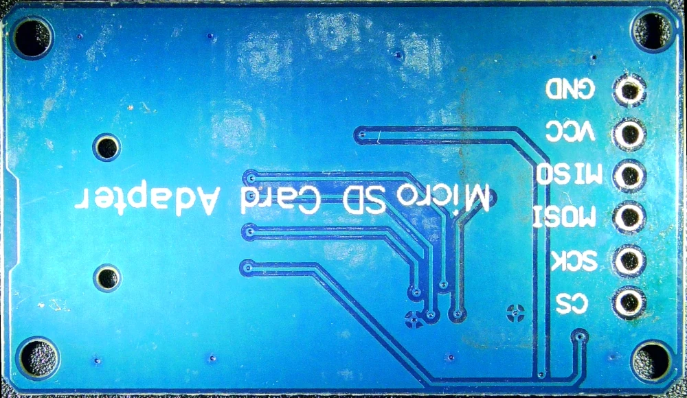
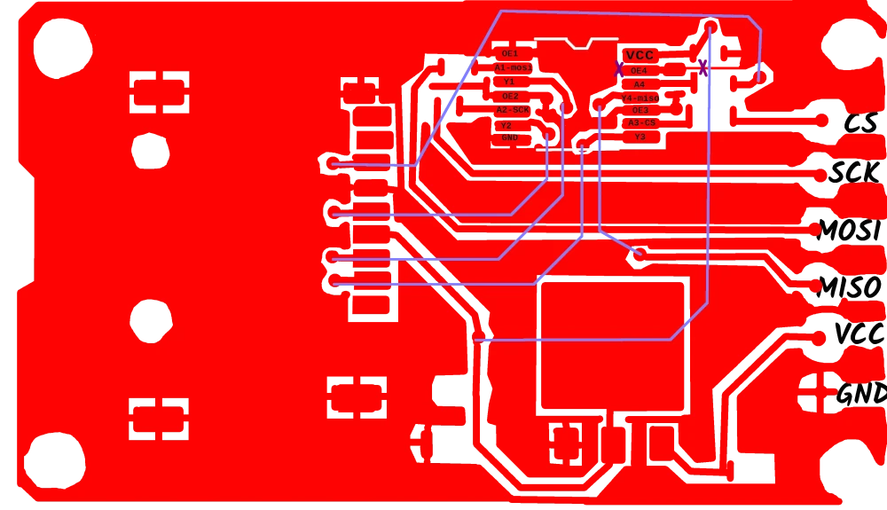
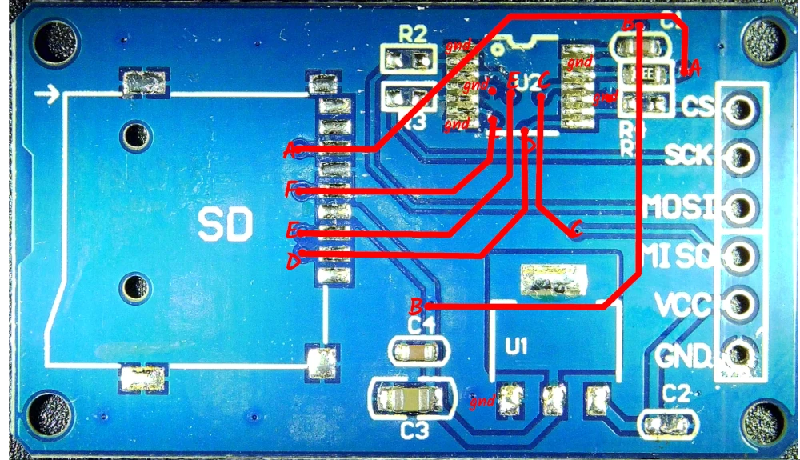
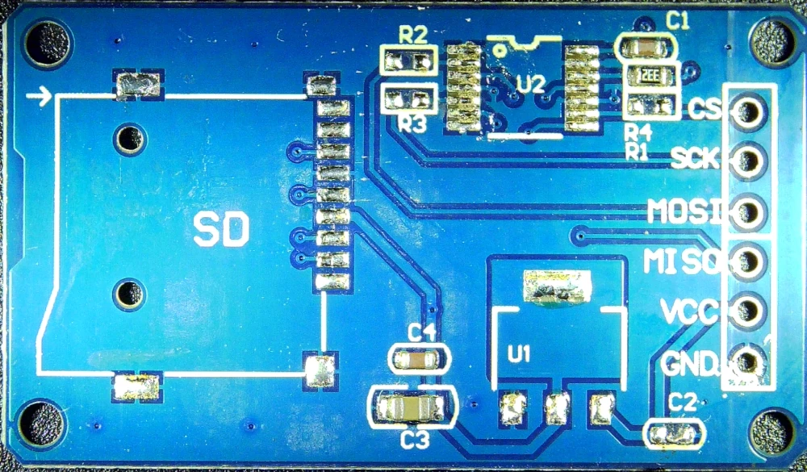

.. vim: set ft=rst showbreak=»\  noexpandtab fileencoding=utf-8 nomodified   wrap textwidth=0 foldmethod=marker foldmarker={{{,}}} foldcolumn=4 ruler showcmd lcs=tab\:|- list tabstop=8 noexpandtab nosmarttab softtabstop=0 shiftwidth=0 linebreak  

SD_card
========

The same as in `Expanduino <http://8bit.gilhad.cz/6809/Expanduino/Expanduino_I.html#sd-karta>`_

I bought some cheap cards from china, with 74HC125 level convertor. basically it is `this type <https://www.hwkitchen.cz/modul-ctecka-micro-sd-sdhc-karet/>`_. 

This cards are known to have problem with `SPI`:

* It does not 3state `MISO` when not selected and so it conflicts with other projects on `SPI`. 
* May also ignore `CS` for `Data In`
* Also it require to have `CS` set to 0 when card is to be insert, and on powerup to set the card to `SPI` compatible mode.
* The solution is to modify this card as in `SOLVED. Nrf24 (Mirf lib) + Micro SD-card works OK together <https://forum.arduino.cc/t/solved-nrf24-mirf-lib-micro-sd-card-works-ok-together/347787/3>`_
* My card cannot be just cut as in the article, because the ground goes there also from the chip - see photos - so I will disconnect it at both places and connect it to `CS` - also it can be done by lifting that leg and soldering wire on it.
* Also it may be done from outside, with some other gates, as in  `Expanduino <http://8bit.gilhad.cz/6809/Expanduino/Expanduino_I.html#sd-karta>`_ Expanduino_I_fix_001_schema.png
* and on next iteration I may just strip the parts and incorporate it into PCB with all `enable` pins (except the for `CS`) connected to `CS` on the PCB

* SD_card.bottom.webp
	|SD_card.bottom.webp|

* SD_card.top.connects.webp
	|SD_card.top.connects.webp|

* SD_card.top.layers.webp
	|SD_card.top.layers.webp|

* SD_card.top.webp
	|SD_card.top.webp|

